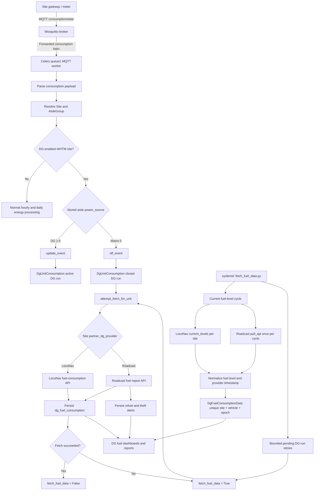

# DG Fuel Architecture

## Overview

The DG fuel subsystem has two independent flows:

1. MQTT DG-session processing records generator runtime and fetches consumed fuel after a run closes.
2. The standalone `fetch_fuel_data.py` service polls provider tank levels and retries incomplete fuel fetches.

`LoadData/state` messages are not part of either DG fuel flow. They are load telemetry only.



## MQTT DG Session Flow

1. The gateway publishes an MQTT `consumption/state` message.
2. Mosquitto forwards the message to the `server_paho_client_1` subscriber.
3. The Celery queue1 worker parses `Unit_consumption`, `Message_time`, and `AisleGrp_id`.
4. The worker resolves the site and aisle group.
5. For DG-enabled WHTM sites:
   - `power_source` from `1` to `5` calls `update_event` to create or update the active `DgUnitConsumption` run.
   - `power_source` of `0` calls `off_event` to close the active run.
6. When a run closes, `attempt_fetch_for_unit` requests total fuel used during the run from the configured provider.
7. A successful fetch stores `dg_fuel_consumption`; a failed fetch sets `fetch_fuel_data=True` for later retry.
8. Roadcast report results may also create normalized `refuel` and `theft` alert rows.

## Standalone Fuel Poller Flow

1. `fetch_fuel_data.py` runs as its own systemd service.
2. Every `DG_FUEL_POLL_INTERVAL_SECONDS` seconds, default 300:
   - LocoNav current levels are fetched once for each LocoNav site.
   - Roadcast current levels are fetched once for all Roadcast sites.
3. Provider values are normalized to numeric fuel values and Unix milliseconds.
4. Valid readings are stored in `DgFuelConsumptionData`.
5. Unavailable or expired provider devices are logged and returned in the cycle summary.
6. Closed DG runs still marked `fetch_fuel_data=True` are retried with bounded streaming:
   - `DG_FUEL_RETRY_BATCH_SIZE`, default 100
   - `DG_FUEL_RETRY_LIMIT_PER_CYCLE`, default 500

## Load Telemetry Separation

`LoadData/state` messages carry load telemetry such as:

- `LoadValue`
- `leg_id`
- `Meter_Number`
- `Datetime`
- `epochTime`

They do not contain a gateway power-source value. Therefore the following call must remain disabled in the `LoadData` handler:

```python
apply_gateway_power_source(
    site,
    load_aisle_group_obj,
    load_data[7].split(":")[1],
    observed_at=load_date,
)
```

Using `load_data[7]` on the five-field `LoadData` payload raises an index error and interrupts load message processing. DG session decisions use the existing stored `AisleGroup.power_source` while processing `consumption/state` messages.

## Main Components

| Component | Responsibility |
| --- | --- |
| `wareApp/tasks.py` | Receives MQTT messages and updates/ends DG sessions from `consumption/state`. |
| `wareApp/dg_fuel/sessions.py` | Creates, coalesces, closes, and resolves DG fuel sessions. |
| `fetch_fuel_data.py` | Standalone periodic provider poller and bounded retry runner. |
| `wareApp/dg_fuel/collection.py` | Collects provider data without database writes. |
| `wareApp/dg_fuel/providers.py` | Parses and normalizes LocoNav and Roadcast payloads. |
| `wareApp/dg_fuel/ingestion.py` | Persists normalized fuel readings and refuel/theft alerts. |
| `DgUnitConsumption` | DG runtime session records and pending fuel-fetch state. |
| `DgFuelConsumptionData` | Timestamped current fuel-level readings. |
| `DGFuelAlertsData` | Refuel, theft, and suspicious-fuel events. |

## Operational Checks

```bash
sudo systemctl status fetch-fuel-data.service --no-pager -l
sudo journalctl -u fetch-fuel-data.service -n 100 --no-pager
pgrep -af 'fetch_fuel_data.py'
```

A healthy deployment has one standalone poller process. Its logs should contain a `DG fuel cycle summary` and should not contain the legacy `Fetching data for Site ID` message.
