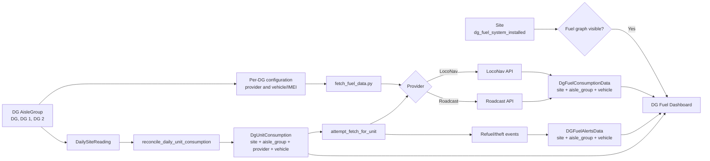

# Multi-DG Fuel Architecture and Flow

## Purpose

A site can contain one or more physical DGs. Each DG must be linked to its own electrical `AisleGroup` and provider device identifier. Fuel data must never be selected by aisle order or a fixed list index.

`Site.dg_fuel_system_installed` remains the frontend visibility switch:

- `False`: do not display the DG fuel graph.
- `True`: display the DG fuel graph.

## Configuration

Configure every physical DG on its `AisleGroup` record:

| Field | Purpose |
| --- | --- |
| `dg_fuel_enabled` | Enables provider polling for this DG aisle. |
| `dg_fuel_provider` | Provider: `loconav` or `roadcast`. |
| `dg_fuel_vehicle_number` | LocoNav vehicle number or Roadcast IMEI. |

Examples:

| Site | Aisle group | Provider | Provider device |
| --- | --- | --- | --- |
| Site A | DG 1 | Roadcast | `353691840557010` |
| Site A | DG 2 | LocoNav | `DCGenerator-02` |
| Site B | DG | Roadcast | `353201353997221` |

For migration compatibility, sites without a configured DG aisle continue to use the existing site-level `partner_dg_provider` and `partner_dg_fuel_id` fields.

## Architecture

## Runtime Flow

1. Admin creates an `AisleGroup` for each physical DG and assigns the appropriate DG role, such as `DG`, `DG 1`, or `DG 2`.
2. Admin enables fuel polling and enters the provider and vehicle number/IMEI on that DG aisle.
3. `fetch_fuel_data.py` selects configured DG aisles and polls each provider device separately.
4. Current tank-level readings are stored in `DgFuelConsumptionData` with the site, DG aisle, provider vehicle, timestamp, and fuel level.
5. Electrical daily readings produce one `DgUnitConsumption` record per DG aisle.
6. The session record snapshots the aisle's provider and vehicle number so later configuration changes do not alter historical attribution.
7. When a DG run is closed, `attempt_fetch_for_unit()` requests consumed fuel from the provider using that DG session's own provider device.
8. Refuel and theft events are stored in `DGFuelAlertsData` against the same DG aisle.
9. The frontend continues to show the DG fuel graph when `Site.dg_fuel_system_installed=True`. It can show individual DG series or a calculated site total.

## Data Rules

- Never use a fixed array position such as `[0]`, `[1]`, or `[2]` to choose a DG.
- A provider vehicle/IMEI must be assigned to one physical DG aisle at a site.
- A site can have one DG or multiple DGs; the same flow applies in both cases.
- Keep site-level provider fields only as a temporary fallback until all DG aisles are configured.
