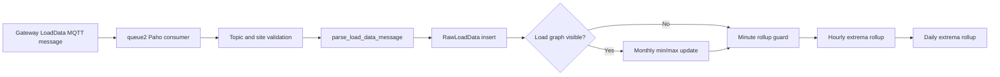

# LoadData Flow and Optimization Report

## Purpose

This document describes the LoadData ingestion path, the responsibility of each component, the optimizations applied, and the validation completed on the test server.

## End-to-End Flow

1. Gateways publish readings on MQTT topics in this form:

   ```text
   /Acclivate/iOmniControl/<site-id>/<gateway-id>/in/LoadData/<subtype>
   ```

2. The queue2 Celery worker starts one long-running Paho MQTT client automatically.
3. The Paho client subscribes only to `.../in/LoadData/#`; it does not receive queue1 business traffic.
4. The consumer validates the MQTT topic, finds the site, and sends the packet to the LoadData handler.
5. The handler parses the gateway payload into a validated `LoadReading` object.
6. The raw reading is saved immediately to `RawLoadData` using the gateway packet timestamp.
7. For sites with `is_loadGraph_visible=True`, the current calendar month's minimum and maximum values are maintained in `MonthlyMinMaxLoadData`.
8. Once per observed minute per site, completed raw-data buckets are rolled up to hourly/min/max data. Completed hourly buckets are rolled up to daily/min/max data.



## Functions and Responsibilities

| File | Function or component | Responsibility |
| --- | --- | --- |
| `wareApp/tasks.py` | `mqtt_client1()` / `mqtt_client2()` | Celery task entry points for the dedicated queue1 and queue2 MQTT clients. |
| `wareApp/tasks.py` | `start_queue_one_mqtt_client()` / `start_queue_two_mqtt_client()` | Starts one listener task when its dedicated worker becomes ready. Shared process-local duplicate protection and active-task inspection prevent repeated worker-ready signals from creating duplicate subscribers. |
| `wareApp/mqtt/routing.py` | `QUEUE_TWO_SUBSCRIPTIONS` | Defines the narrow queue2 subscription: only `LoadData` topics. |
| `wareApp/mqtt/consumers.py` | `run_mqtt_client2()` | Connects to Mosquitto, subscribes to queue2 topics, validates topic/site information, and invokes the LoadData handler. |
| `wareApp/load_data/parser.py` | `parse_load_data_message()` | Normalizes and validates payload fields, returning immutable `LoadReading(load_value, leg_id, meter_number, created, epoch_time)`. Invalid or incomplete payloads raise `ValueError`. |
| `wareApp/load_data/handler.py` | `handle_load_data_message()` | Coordinates parsing, aisle-group lookup, raw storage, optional monthly update, and rollup scheduling. Logs and skips invalid packets without stopping the MQTT consumer. |
| `wareApp/load_data/raw.py` | `save_raw_load_reading()` | Inserts every valid packet immediately into `RawLoadData`. |
| `wareApp/load_data/monthly.py` | `update_monthly_min_max_load()` | Maintains current-month minimum/maximum readings per site and power source, and updates matching `SiteLoadPower` bounds. |
| `wareApp/load_data/rollups.py` | `roll_up_load_data_if_due()` | Ensures a site runs at most one rollup for the same observed minute. |
| `wareApp/load_data/rollups.py` | `roll_up_completed_load_data()` | Produces missing hourly min/max records from raw readings and daily min/max records from hourly readings. |

## Optimizations Applied

### 1. Dedicated LoadData MQTT Consumer

Before optimization, broad MQTT subscriptions allowed high-frequency LoadData traffic to share the same path as other business messages. LoadData is now isolated to `queue2` and subscribed only to the LoadData topic pattern.

Benefits:

- High-volume LoadData traffic cannot delay queue1 business processing.
- The queue2 worker can be monitored and scaled independently.
- Topic validation prevents unexpected messages from entering the LoadData path.

### 2. One MQTT Client Per Listener Worker

The queue1 and queue2 worker-ready startup is guarded with a process-level lock and dispatch state. Legacy task dispatch from `warehouse/urls.py` was removed because it created a second MQTT client whenever Django loaded the URL configuration.

Verified test-server state after deployment:

- One active `wareApp.tasks.mqtt_client2` task.
- No reserved duplicate task.
- `queue2` had zero pending messages and one consumer.

### 3. Immediate Raw Storage with Efficient Rollups

Every valid packet is written directly to `RawLoadData`; packets are not delayed waiting for a five-second, ten-second, or multi-minute arrival interval. Rollups operate only on completed time buckets and are guarded to run once per observed minute per site.

Benefits:

- No valid raw LoadData packets are discarded because of gateway reporting frequency.
- Repeated packets in the same minute do not repeatedly run the same site rollup.
- Historical and delayed packets can still be included during the configured rollup lookback window.

### 4. Index-Friendly Monthly Query

The monthly min/max lookup previously filtered with:

```python
created__year=today_date.year,
created__month=today_date.month,
```

PostgreSQL translated this into `EXTRACT(...)` conditions, which prevented an efficient normal date-index lookup. It now uses an inclusive/exclusive calendar-month range:

```python
created__gte=month_start,
created__lt=next_month_start,
```

This preserves the current-month behavior while allowing PostgreSQL to use a B-tree index.

### 5. Production PostgreSQL Indexes

The server had approximately 35 million `RawLoadData` rows and 14 million `HourlyLoadData` rows, but only single-column foreign-key indexes. Rollup queries filtered by both site and timestamp, causing parallel scans and high PostgreSQL CPU.

The following indexes were created on the test server with `CREATE INDEX CONCURRENTLY`, so normal LoadData reads and writes continued while indexes were built:

| Index | Columns | Used by |
| --- | --- | --- |
| `idx_monthlyminmax_site_source_created` | `site_id, supply_source, created` | Monthly min/max lookup |
| `idx_live_rawload_site_created` | `site_id, created` | Raw-to-hourly rollup |
| `idx_live_hourlyload_site_created` | `site_id, created` | Hourly-to-daily rollup |
| `idx_live_dailyload_site_created` | `site_id, created` | Existing daily-bucket lookup path |

Post-deployment `EXPLAIN` confirmed index scans for the monthly, raw, and hourly lookup shapes.

## Files Changed

| File | Change |
| --- | --- |
| `wareApp/mqtt/routing.py` | Split queue1 and queue2 topic subscriptions; queue2 owns only LoadData. |
| `wareApp/mqtt/topics.py` | Added structured gateway topic parsing and validation. |
| `wareApp/mqtt/consumers.py` | Added isolated queue2 LoadData consumer. |
| `wareApp/tasks.py` | Added queue2 startup hook with duplicate-dispatch protection; retained queue1 processing separation. |
| `warehouse/urls.py` | Removed legacy import-time `mqtt_client2.apply_async()` startup that caused duplicate consumers. |
| `wareApp/load_data/parser.py` | Added validated, normalized LoadData payload parser. |
| `wareApp/load_data/raw.py` | Added immediate raw-reading persistence helper. |
| `wareApp/load_data/handler.py` | Uses modular parsing, raw persistence, monthly update, and rollup functions. |
| `wareApp/load_data/monthly.py` | Replaced month extraction filtering with index-friendly calendar-month bounds. |
| `wareApp/load_data/rollups.py` | Added guarded, idempotent raw-to-hourly and hourly-to-daily rollup logic. |
| `wareApp/tests/test_mqtt_topics.py` | Added queue routing, subscription, worker-start, and duplicate-start coverage. |
| `wareApp/tests/test_load_data.py` | Added parsing, raw handling, monthly bounds, and rollup behavior coverage. |

## Validation and Test Results

The following checks completed successfully in the local project environment:

| Validation | Result |
| --- | --- |
| Queue2 worker-start and duplicate-dispatch tests | 4 tests passed |
| MQTT routing and LoadData regression suite | 39 tests passed |
| LoadData suite after monthly query optimization | 12 tests passed |
| Python syntax compilation for `wareApp/tasks.py` | Passed |
| `manage.py check` | Passed with 4 pre-existing model warnings and no errors |
| `git diff --check` | Passed |

The malformed-payload test deliberately logs a `ValueError` for `bad-payload`; this is expected behavior and the test suite passes.

## Migration Note

The test server and local repository have incompatible Django migration histories after migration `0080`. For that reason, performance indexes were intentionally created directly in PostgreSQL rather than by running `manage.py migrate`. This avoided applying unrelated or unsafe schema changes.

Before future schema changes are deployed with Django migrations, the local and server migration chains must be reconciled into one valid history. The live indexes should then be represented by server-compatible Django migrations to keep schema history complete.