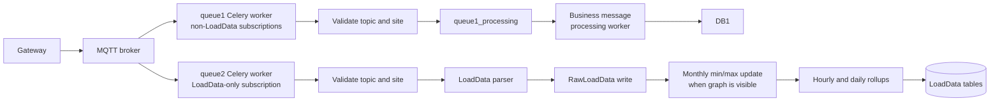

# MQTT and LoadData Optimization Completion Report

## Scope

This document records the completed low-risk optimization work for gateway MQTT traffic.
It covers the isolated `LoadData` path and the remaining queue-1 message families.

## Tested Tags

| Tag | Commit | Coverage |
| --- | --- | --- |
| `loaddata-optimization-tested-v1` | `fe4a4819` | Isolated LoadData processing, persistence, rollups, and live simulator validation. |
| `mqtt-low-risk-optimization-tested-v1` | `a1dd4ab5` | Queue isolation, queue-1 query/logging improvements, focused tests, and live worker checks. |

## Queue Ownership

Gateway topics have the form:

```text
/Acclivate/iOmniControl/<site_id>/<gateway_id>/in/<message_type>/<subtype>
```

| Celery queue | MQTT subscription | Owned message types |
| --- | --- | --- |
| `queue1` | `/Acclivate/iOmniControl/+/+/in/<queue1-type>/#` | `consumption`, `sync`, `FIREALARM`, `load`, `SupplyTime`, `recovery`, `remoteAccess` |
| `queue2` | `/Acclivate/iOmniControl/+/+/in/LoadData/#` | `LoadData` only |

The routing contract is defined in `wareApp/mqtt/routing.py`. Narrow broker subscriptions keep high-rate `LoadData` packets out of queue-1 instead of filtering them after delivery.

## Processing Flow



## LoadData Improvements

- Moved active LoadData handling into focused modules for parsing, raw persistence, monthly extrema, and rollups.
- Made payload parsing field-based and order-independent, with support for historical key aliases.
- Added validated MQTT topic parsing and a dedicated queue-2 consumer.
- Replaced print-heavy queue-2 output with structured logs.
- Added indexes aligned to rollup filters and ordering:
  - `RawLoadData(site, created)`
  - `HourlyLoadData(site, aisle_group, created)`
  - `DailyLoadData(site, aisle_group, created)`
- Batched materialized-bucket checks and extrema inserts.
- Deferred `SiteLoadPower` work until a new monthly minimum or maximum is found.
- Aligned raw rollup ordering with the raw composite index.

## Queue-1 Improvements

- Added connection lifecycle logs and guarded MQTT ingress for malformed topics, unexpected message types, and missing sites.
- Converted branch failure reporting to `logger.exception`, preserving catch-and-continue behavior while retaining Celery tracebacks.
- Removed the callback site lookup; `queue1_processing` validates the site alongside its business work.
- Reduced repeated queryset evaluation in consumption, fire-alarm, load, SupplyTime, and recovery paths by caching records obtained with `.first()`.
- Replaced safe `exists()` followed immediately by `update()` patterns with update row-count checks.
- Replaced voltage history `count()` plus slice queries with a bounded seven-row read while retaining the existing six-reading threshold and newest-five evaluation.
- Normalized MQTT payload bytes once at ingress, while retaining handler compatibility with legacy `b'...'` task payloads.
- Demoted normal per-packet queue1 handoff logs to `DEBUG`, preserving warning/error visibility without high-volume worker log output.
- Made consumption and SupplyTime counters database-side atomic updates, preventing lost increments when processing concurrency increases.
- Locks the affected aisle group during consumption processing, preventing concurrent first packets from creating duplicate hourly or daily records.
- Removed the common-path consumption daily-row read; it now uses an atomic update and only loads that row during hourly-gap reconciliation.
- Replaced SupplyTime month-end Python scans with an indexed grouped database aggregate and idempotent monthly-share persistence.
- Added the queue1 composite query indexes in migration `0086_add_queue_one_query_indexes`.

## Full Optimization: Active Callback Offloads

`consumption`, `load`, `SupplyTime`, `FIREALARM`, `recovery/loadRuntime`, `recovery/dailyConsumption`, and `recovery/hourlyConsumption` are moved out of the MQTT callback. The queue-1 subscriber validates and routes the topic, then places compact payloads on `queue1_processing` without querying the database. The processing worker validates the site, then performs consumption, load, fire-pump, runtime, and recovery database updates, monthly aggregation, and any recovery publish.

This creates a durable RabbitMQ handoff and keeps the Paho callback independent of business database, notification, and recovery-publish latency. The active implementations are `wareApp/mqtt/consumption.py`, `wareApp/mqtt/load.py`, `wareApp/mqtt/supply_time.py`, `wareApp/mqtt/fire_alarm.py`, `wareApp/mqtt/load_runtime_recovery.py`, `wareApp/mqtt/daily_consumption_recovery.py`, `wareApp/mqtt/hourly_consumption_recovery.py`, `wareApp.tasks.process_consumption_message`, `wareApp.tasks.process_load_message`, `wareApp.tasks.process_supply_time_message`, `wareApp.tasks.process_fire_alarm_message`, `wareApp.tasks.process_load_runtime_recovery_message`, `wareApp.tasks.process_daily_consumption_recovery_message`, and `wareApp.tasks.process_hourly_consumption_recovery_message`.

`sync` remains an outbound gateway-recovery command and `remoteAccess` has no implemented inbound contract. Both topic names remain recognized for compatibility, but queue1 does not subscribe to either one, so they do not create no-op callback work.

Remote access is also outbound-only: `wareApp.mqtt.remote_access.request_remote_access()` validates `start`, `stop`, or `restart` commands and publishes the gateway-agent payload format `<action>_<retry_count>` to `remoteAccess/state`. It never executes gateway shell commands on the backend; an authorized API may call this publisher when that control surface is required.

Unsupported subtypes, including unknown recovery subtypes, stop at the dispatcher boundary and cannot enter legacy callback code.

## Logging Contract

| Level | Meaning |
| --- | --- |
| `INFO` | Worker start, MQTT connection/subscription, and successful LoadData persistence. |
| `WARNING` | Malformed/unexpected topics and messages for missing sites. |
| `ERROR` with traceback | Unexpected branch failures captured through `logger.exception`. |
| `DEBUG` | Legacy queue-1 diagnostic print output redirected through the logger. |

## Validation Performed

- Focused Django test suite:

  ```text
  manage.py test wareApp.tests.test_load_data wareApp.tests.test_mqtt_topics
  ```

  Result: `65` queue1 routing and handler tests passed.

- Python compile checks for active consumer and LoadData modules.
- `git diff --check` completed without whitespace errors.
- Queue-2 live simulator published one LoadData message per second and confirmed fresh `RawLoadData` records.
- Queue-1 live worker was started and subscribed successfully.
- Queue-1 ingress was tested with a valid `consumption` topic for a nonexistent site; it is handed to `queue1_processing`, which logs the missing-site warning and returns without a business write.

## Operations

The dedicated queue1 and queue2 workers automatically enqueue their respective long-running MQTT listeners when they become ready. Start each listener worker with a hostname containing its queue name, and do not manually enqueue `mqtt_client1` or `mqtt_client2` after startup:

```bash
celery -A warehouse worker --queues=queue1 --hostname=worker.queue1@%h --concurrency=1 --loglevel=INFO
celery -A warehouse worker --queues=queue2 --hostname=worker.queue2@%h --concurrency=1 --loglevel=INFO
```

Use one worker and one long-running listener per queue. Starting duplicates creates duplicate MQTT subscribers and may duplicate business processing.

The Paho clients retry broker connections internally. A non-success Paho loop exit is raised as a listener-task failure, so Celery retries it on the same queue with exponential backoff capped at 30 seconds; a clean loop exit and normal worker shutdown are not retried.

Active MQTT handlers validate named gateway fields instead of relying on packet position, so field ordering does not change the persisted values. Recovery handlers accept both trailing-comma and no-trailing-comma payloads and process every valid recovered reading. Latest runtime, baseline, and hourly records are selected by their business timestamps rather than insertion order.

Remote-access publishing validates the site ID, gateway topic segment, action, and retry count before emitting the QoS 1 command.

The business and LoadData handoffs require separate serial processing workers:

```bash
celery -A warehouse worker --queues=queue1_processing --concurrency=1 --loglevel=INFO
celery -A warehouse worker --queues=queue2_processing --concurrency=1 --loglevel=INFO
```

Live validation confirmed that queue-1 enqueued malformed `consumption`, `load`, SupplyTime, `FIREALARM`, `recovery/loadRuntime`, `recovery/dailyConsumption`, and `recovery/hourlyConsumption` packets, and the processing worker isolated all seven parse failures without database writes.

## Deliberate Boundary

The legacy callback bodies remain below the active handoff returns as rollback references. Further work should focus on branch-specific integration tests and production query timing before deleting those inactive bodies.