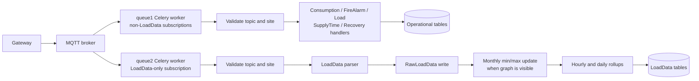

# MQTT and LoadData Optimization Completion Report

## Scope

This document records the completed low-risk optimization work for gateway MQTT traffic.
It covers the isolated `LoadData` path and the remaining queue-1 message families.

## Tested Tags

| Tag | Commit | Coverage |
| --- | --- | --- |
| `loaddata-optimization-tested-v1` | `fe4a4819` | Isolated LoadData processing, persistence, rollups, and live simulator validation. |
| `mqtt-low-risk-optimization-tested-v1` | `a1dd4ab5` | Queue isolation, queue-1 query/logging improvements, focused tests, and live worker checks. |

## Queue Ownership

Gateway topics have the form:

```text
/Acclivate/iOmniControl/<site_id>/<gateway_id>/in/<message_type>/<subtype>
```

| Celery queue | MQTT subscription | Owned message types |
| --- | --- | --- |
| `queue1` | `/Acclivate/iOmniControl/+/+/in/<queue1-type>/#` | `consumption`, `sync`, `FIREALARM`, `load`, `SupplyTime`, `recovery`, `remoteAccess` |
| `queue2` | `/Acclivate/iOmniControl/+/+/in/LoadData/#` | `LoadData` only |

The routing contract is defined in `wareApp/mqtt/routing.py`. Narrow broker subscriptions keep high-rate `LoadData` packets out of queue-1 instead of filtering them after delivery.

## Processing Flow



## LoadData Improvements

- Moved active LoadData handling into focused modules for parsing, raw persistence, monthly extrema, and rollups.
- Made payload parsing field-based and order-independent, with support for historical key aliases.
- Added validated MQTT topic parsing and a dedicated queue-2 consumer.
- Replaced print-heavy queue-2 output with structured logs.
- Added indexes aligned to rollup filters and ordering:
  - `RawLoadData(site, created)`
  - `HourlyLoadData(site, aisle_group, created)`
  - `DailyLoadData(site, aisle_group, created)`
- Batched materialized-bucket checks and extrema inserts.
- Deferred `SiteLoadPower` work until a new monthly minimum or maximum is found.
- Aligned raw rollup ordering with the raw composite index.

## Queue-1 Improvements

- Added connection lifecycle logs and guarded MQTT ingress for malformed topics, unexpected message types, and missing sites.
- Converted branch failure reporting to `logger.exception`, preserving catch-and-continue behavior while retaining Celery tracebacks.
- Reused ingress-resolved `Site` objects instead of re-querying them.
- Reduced repeated queryset evaluation in consumption, fire-alarm, load, SupplyTime, and recovery paths by caching records obtained with `.first()`.
- Replaced safe `exists()` followed immediately by `update()` patterns with update row-count checks.
- Replaced voltage history `count()` plus slice queries with a bounded seven-row read while retaining the existing six-reading threshold and newest-five evaluation.

## Logging Contract

| Level | Meaning |
| --- | --- |
| `INFO` | Worker start, MQTT connection/subscription, and successful LoadData persistence. |
| `WARNING` | Malformed/unexpected topics and messages for missing sites. |
| `ERROR` with traceback | Unexpected branch failures captured through `logger.exception`. |
| `DEBUG` | Legacy queue-1 diagnostic print output redirected through the logger. |

## Validation Performed

- Focused Django test suite:

  ```text
  manage.py test wareApp.tests.test_load_data wareApp.tests.test_mqtt_topics
  ```

  Result: `29` tests passed.

- Python compile checks for active consumer and LoadData modules.
- `git diff --check` completed without whitespace errors.
- Queue-2 live simulator published one LoadData message per second and confirmed fresh `RawLoadData` records.
- Queue-1 live worker was started and subscribed successfully.
- Queue-1 ingress was live-tested with a valid `consumption` topic for a nonexistent site; it logged a warning and returned without a business write.

## Operations

The MQTT clients are long-running Celery tasks. Restarting a worker does not restart the client automatically; enqueue the corresponding task after worker startup:

```python
from wareApp.tasks import mqtt_client1, mqtt_client2

mqtt_client1.apply_async(queue="queue1")
mqtt_client2.apply_async(queue="queue2")
```

Use one long-running task per queue. Starting duplicates creates duplicate MQTT subscribers and may duplicate business processing.

## Deliberate Boundary

The queue-1 business branches remain legacy code because they can create alarms, send email, publish recovery commands, and modify operational records. Further work should begin with branch-specific integration tests and production query timing, rather than broad refactoring.