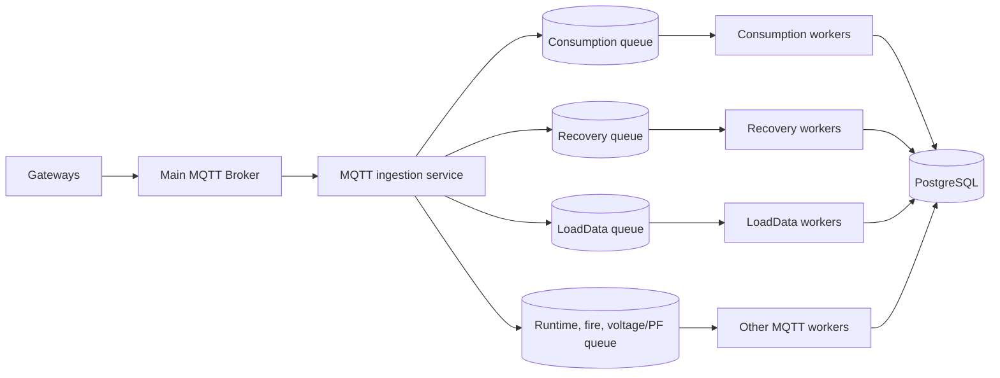

# tasks.py Modernization Roadmap

## Scope and Rule

Modernize one MQTT message family at a time. Do not alter the behavior of another family while working on the current one. Every phase requires focused tests, a compile check, and a staged worker rollout.

## Current Server Topology

The main server receives all gateway MQTT traffic. It currently processes the critical operational families:

- `consumption`
- `recovery` and sync responses
- `SupplyTime`
- fire alarms
- lower-case `load` messages for voltage and power-factor handling

`LoadData` is currently redirected to the test server because its 5 to 10 second message rate previously occupied the available worker capacity and delayed the critical message families. The test server runs the isolated LoadData consumer and writes its raw and rollup records through the LoadData path.

This split protects production processing, but it duplicates server cost and operational work.

## Target Architecture: One Main Server, Independent Message Families

The end state is one main server and one MQTT broker. `LoadData` returns to the main server, but no MQTT callback performs database work directly. A lightweight ingestion service validates and routes every message into durable queues. Independent workers consume their own message family concurrently.

This is not a topic-priority system. Each message family has independent capacity, so a burst of LoadData cannot block consumption, recovery, runtime, fire, or voltage processing.



### Why the Current Design Cannot Scale Reliably

The current `mqtt_client1` and `mqtt_client2` tasks call `client.loop_forever()` and execute parsing, database queries, writes, mail work, and recovery publishing inside Paho's message callback. One slow database query or a burst of LoadData blocks the callback thread from accepting the next message. Starting more Celery workers does not solve this completely because each long-running task remains one blocking MQTT client loop.

At 200 gateways reporting every 5 seconds, LoadData alone can reach about $200 / 5 = 40$ messages per second before counting consumption, recovery, runtime, or alarm topics. The callback must therefore do only bounded, non-blocking work.

### Required Routing Rules

1. Run one MQTT ingestion service on the main server. Its callback parses the topic, validates the payload shape, attaches an idempotency key, and enqueues work. It does not call Django models, send email, or calculate rollups.
2. Route messages by message family, not urgency: `consumption`, `recovery`, `LoadData`, and `SupplyTime`/fire/voltage/PF each use a named queue.
3. Run at least one worker process per queue. LoadData can use several worker processes without changing any other message family.
4. Subscribe the ingestion service once to the full MQTT root, or use separate narrow subscriptions for each family. If narrow subscriptions are used, LoadData uses:

   ```text
   /Acclivate/iOmniControl/+/+/in/LoadData/#
   ```

5. Use RabbitMQ/Celery queues as durable buffers. A temporary database slowdown accumulates queue depth instead of blocking MQTT delivery.
6. Make every handler idempotent. The existing LoadData completed-bucket checks are the model; consumption and recovery need the same treatment before they are parallelized.
7. Stop the broker bridge or forwarding rule that sends LoadData to the test server only after main-server ingestion and LoadData workers are verified.
8. Keep the current load-data database routing and verify the main server can access the same tables before cutover.

### Worker Sizing for 200+ Gateways

Start with separate worker processes, then tune from observed queue depth and processing time:

| Queue | Initial worker processes | Concurrency | Scaling signal |
| --- | --- | --- | --- |
| `mqtt.consumption` | 1 | 2 | oldest message age above 30 seconds |
| `mqtt.recovery` | 1 | 2 | backlog grows after a recovery burst |
| `mqtt.load_data` | 1 | 4 | sustained queue depth or processing slower than ingestion |
| `mqtt.other` | 1 | 2 | oldest message age above 30 seconds |

Use conservative database connection limits: total worker concurrency must fit PostgreSQL's available connections. Increase LoadData concurrency only after confirming raw inserts, rollups, and database connection usage remain healthy.

The optimized LoadData handler already limits completed-bucket rollups to once per site per observed minute. The next optimization is batch raw LoadData writes in a short bounded window, such as 1 second or 100 rows, using `bulk_create`. Do not batch consumption or recovery until their idempotency tests exist.

### Implementation Order

1. Extract a tested MQTT topic parser from `tasks.py`.
2. Create `wareApp/mqtt/ingestion.py` with a fast Paho callback that routes to Celery queues only.
3. Convert the existing LoadData handler into a normal Celery task, preserving the current tested logic.
4. Run the ingestion service and LoadData worker on the main server in shadow mode while the test server continues to receive LoadData.
5. Extract consumption, recovery, runtime, fire, and voltage handlers one family at a time into normal Celery tasks.
6. Add retry, dead-letter/error logging, idempotency keys, queue-depth metrics, and message-age metrics.
7. Cut off test-server forwarding only after main-server queue depth, message age, and stored-row comparisons are stable.

### Process Model

Use `systemd` or Supervisor for the MQTT ingestion service because it is a daemon, not a finite background job. Use Celery workers for finite queued message-processing tasks. Do not continue to run `client.loop_forever()` inside Celery task bodies after the migration.

## Main-Server Cutover Plan

### Stage A: Preflight

1. Deploy tag `loaddata-interval-safe-v1` to the main server.
2. Confirm the main server has the `wareApp/load_data/` package and the LoadData database connection/routing.
3. Add a main-server ingestion daemon and a separate `mqtt.load_data` worker process.
4. Configure dedicated logs, restart policies, queue-depth alerts, and database connection limits.

### Stage B: Shadow Verification

1. Start main-server ingestion and the LoadData worker while test-server forwarding remains enabled.
2. For a controlled site, compare raw receipt counts and derived hourly/min/max rows on both servers for 15 minutes.
3. Test gateway intervals of 12 seconds, then 300 seconds.
4. Confirm consumption, recovery, and runtime queue age remains normal while LoadData traffic is present.

### Stage C: Cutover

1. Change the broker bridge/routing so LoadData is delivered to the main server only.
2. Keep the test server running but idle for one observation window.
3. Monitor main-server worker logs, broker delivery logs, raw row counts, and rollup rows.
4. If any discrepancy appears, restore test-server forwarding immediately.

### Stage D: Decommission Test Server

1. After at least one normal production day, stop the test-server LoadData worker.
2. Retain its deployment and logs for the agreed rollback period.
3. Shut down the test server only after confirming no bridge or scheduled process depends on it.

## Completed: LoadData

Status: completed and tagged as `loaddata-interval-safe-v1`.

- `LoadData` was extracted from `wareApp/tasks.py` into `wareApp/load_data/`.
- Payload parsing, raw storage, monthly min/max, and rollups are separated.
- Rollups process completed buckets, so 5 to 300 second gateway intervals work.
- Rollups are throttled to one scan per site per observed minute.
- Duplicate bucket creation and malformed payload handling are covered.
- Tests: `./virtualwarehouse/bin/python manage.py test wareApp.tests.test_load_data --verbosity 1`.

## Phase 0: Establish a Safe Test Harness

Goal: make each future extraction testable without a live MQTT broker.

1. Add a small reusable MQTT-topic parser that returns `site_id`, `gateway_id`, message type, and subtype.
2. Add unit tests for valid topics, missing segments, invalid site IDs, and unknown message types.
3. Keep `mqtt_client1` and `mqtt_client2` behavior unchanged; use the parser only after its tests pass.
4. Add structured logger instances per module. Do not replace all `print` calls in one change.

Exit criteria:

- Topic parser has focused tests.
- Existing consumers still subscribe to `/Acclivate/iOmniControl/#`.
- No message handling changes outside the parser call site.

## Phase 1: Shared Alarm Notification Service

Target: duplicated `send_mail_for_alarms` helpers in both MQTT tasks.

1. Extract alarm lookup and HTML email construction to `wareApp/mqtt/alarms.py`.
2. Replace the large `if/elif` alarm-type email blocks with a subject mapping and one rendering function.
3. Preserve existing recipients, subjects, and `AlarmNotifications` lookup behavior.
4. Test every supported alarm type and the no-alarm-record path.

Exit criteria:

- No behavior changes to consumption, fire, load, runtime, or recovery handlers.
- Queue 1 and queue 2 call the same tested notification service.

## Phase 2: Consumption Message Handler

Target: queue 1 `consumption` branch.

1. Create `wareApp/mqtt/consumption/parser.py` for the gateway payload.
2. Create `wareApp/mqtt/consumption/service.py` for hourly/daily persistence and baseline calculation.
3. Keep recovery-command publishing in a dedicated function.
4. Add tests for first reading, same-hour update, missing previous hour, day boundary, and baseline unavailable.
5. Deploy only queue 1 after test verification.

Exit criteria:

- The handler has no direct payload string splitting.
- Hourly and daily updates are idempotent for repeated packets.
- Recovery MQTT publishing is tested with a mocked client.

## Phase 3: Recovery Handlers

Target: queue 1 `recovery` subtypes: `dailyConsumption`, `hourlyConsumption`, and `loadRuntime`.

1. Split each recovery subtype into its own function/module.
2. Introduce a shared parser for `ERROR404` values and timestamp lists.
3. Add per-record error reporting so one bad recovery row does not skip the rest of the response.
4. Test create, update, existing-higher-value behavior, and malformed recovery payloads.

Exit criteria:

- Each subtype can be tested without an MQTT connection.
- Recovery remains idempotent when the same response arrives twice.

## Phase 4: Fire Alarm Handler

Target: queue 1 `FIREALARM` branch.

1. Parse fire-pump values into a small data object.
2. Move state transition rules to `wareApp/mqtt/fire_alarm.py`.
3. Move email-throttling checks to a dedicated notification helper.
4. Test auto/manual/off transitions and the 10-minute resend threshold.

Exit criteria:

- Transition logic is table-tested.
- Mail history behavior remains unchanged.

## Phase 5: Load, Voltage, and Power-Factor Handler

Target: queue 1 lower-case `load` branch.

1. Separate payload parsing from live `SiteLoadPower` updates.
2. Extract voltage persistence/threshold evaluation.
3. Extract power-factor persistence/threshold evaluation.
4. Retain the existing 30-minute alarm deduplication semantics.
5. Add tests for normal, high voltage, low voltage, PF fluctuation, and repeated alarm packets.

Exit criteria:

- No direct payload indexing remains in the branch.
- Voltage/PF alarms are individually testable.

## Phase 6: Supply Runtime Handler

Target: queue 1 `SupplyTime` branch.

1. Extract parser and persistence service.
2. Separate hourly runtime write, prior-hour recovery publish, and monthly percentage calculation.
3. Correct only verified defects under focused tests; do not change percentage business rules by assumption.
4. Add tests for new hour, update, missing previous hour, month rollover, and zero total runtime.

Exit criteria:

- Monthly share calculation has deterministic test cases.
- Runtime recovery publishing is mock-tested.

## Phase 7: MQTT Runtime and Celery Operations

Target: client lifecycle rather than message business logic.

1. Move broker host, port, client IDs, topic, and keepalive to Django settings/environment variables.
2. Give the critical and LoadData consumers separate topic subscriptions, process definitions, logs, and restart policies on the main server.
3. Add reconnect/backoff callbacks and clean worker shutdown handling.
4. Add health logging/metrics for received, processed, skipped, and failed messages by family.

Exit criteria:

- No hard-coded broker endpoint remains in `tasks.py`.
- Worker restart does not create duplicate consumers.
- Operators can see processing rate and failures.

## Final Cleanup

1. Remove dead legacy code only after its replacement has been deployed and observed.
2. Replace wildcard imports in touched modules with explicit imports.
3. Remove duplicate `datetime` imports.
4. Keep `tasks.py` as a small worker/bootstrap module that delegates to tested handlers.
5. Tag each completed phase separately and retain a backup before high-risk migrations.

## Deployment Checklist for Every Phase

1. Run focused tests.
2. Run `py_compile` on touched modules.
3. Commit and tag the phase.
4. Deploy only the affected Celery queue.
5. Monitor one site with known traffic.
6. Compare raw messages and derived rows for 10 to 15 minutes.
7. Roll back to the tag if behavior differs.
